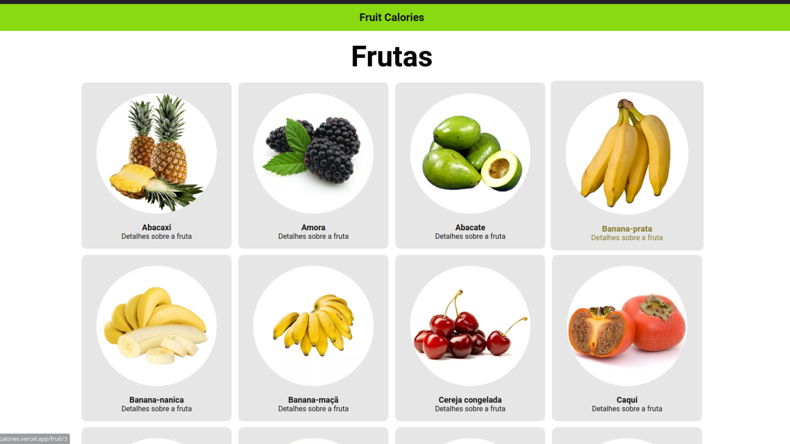
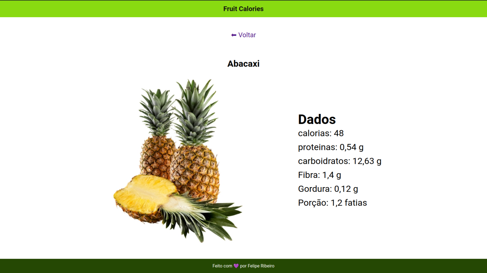

<h3 align="center">    
    <b>Fruit Calories</b>     
</h3>

 <a>
  
    

  # Índice

- [Sobre](#sobre)
- [Tecnologias Utilizadas](#tecnologias-utilizadas)

  ## :bookmark: Sobre

Aplicação feita para informação das propriedades de cada fruta.

## :rocket: Tecnologias Utilizadas

O projeto foi desenvolvido utilizando as seguintes tecnologias:

* React
* JavaScript
* Node.js

## :memo: License

Esse projeto está sob a licença MIT. Veja o arquivo [LICENSE](LICENSE.md) para mais detalhes.

---

<h4 align="center">
    Feito com 💜 by <a href="https://www.linkedin.com/in/lfeliperibeiro/" target="_blank">Felipe Ribeiro</a>
</h4>